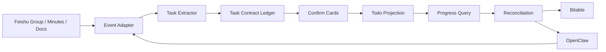

# TeamTask Agent Architecture

## Mermaid Architecture Diagram



## 1. 总体架构

TeamTask Agent 是一个 FastAPI 后端，连接飞书事件、飞书卡片、OpenClaw 自然语言入口、任务合同账本、个人 Todo Projection、资源推荐和进度对账。系统默认运行在 `local_mock`，真实读写必须显式开启并通过白名单与授权校验。

## 2. 数据流

```text
Feishu Event
  -> Event Adapter
  -> Event Router
  -> Task Extractor
  -> Contract Ledger
  -> Initiator Card
  -> Card Callback
  -> Assignee Card
  -> Todo Projection
  -> Progress Query
  -> Reconciliation
  -> Review Card
```

关键路径：

- `POST /feishu/events` 接收群聊消息、会议妙记链接或真实飞书事件。
- `services/feishu_event_adapter.py` 把飞书 payload 转换为内部 SourceEvent。
- `services/task_extractor.py` 产生结构化 TaskCandidate。
- `task_contracts` 保存 Task Contract Ledger。
- `cards/builders.py` 生成内部卡片 JSON。
- `POST /feishu/card-callback` 处理发起者、执行者、进度、变更和对账动作。
- `personal_todo_projections` 保存个人 Todo Projection。
- `progress_queries` 保存群聊进度查询与执行者确认结果。
- `reconciliation_runs` 和 `reconciliation_items` 保存对账批次与字段差异。

## 3. 权限流

```text
User Auth Grant
  -> Access Guard
  -> External Read Guard
  -> External Write Guard
  -> Todo Backend / Minutes Backend / Resource Search Backend
```

权限层职责：

- `user_auth_grants` 记录用户授权和对账 scope。
- `core/access_guard.py` 处理环境 profile 和白名单用户/群聊。
- `core/external_read_guard.py` 阻止 mock、dry-run、未开启 real-read、测试环境和未授权读取。
- `core/external_write_guard.py` 阻止 mock、dry-run、非 Bitable、缺配置和测试环境写入。
- Todo Backend 只在 guard 通过后读写外部 Bitable。

## 4. 核心数据表

- `task_contracts`: Task Contract Ledger，保存任务标题、描述、发起者、执行者、状态、DDL、资源、进度字段。
- `personal_todo_projections`: 个人 Todo Projection，把同一份 task_contract 投影给发起者或执行者。
- `progress_queries`: 群聊进度查询记录，先发给执行者确认，再生成回复摘要。
- `reconciliation_runs`: 一次对账运行，支持 single_task、all_tasks、project。
- `reconciliation_items`: 每个任务的字段差异、建议处理方式和审核卡片。
- `change_proposals`: 执行者对 deadline/title/description 等发起者主控字段的修改申请。

## 5. 状态机说明

任务状态只允许通过 `state_machine.py` 中的函数变更：

- `candidate_extracted`
- `pending_initiator_confirm`
- `pending_assignee_confirm`
- `active`
- `progress_updated`
- `change_pending_initiator_review`
- `completed`
- `cancelled`
- `ignored`

非法迁移会抛异常。卡片回调不会直接写状态字段，而是调用状态机函数。

## 6. 为什么 LLM 只做结构化抽取

LLM 可以从会议纪要和群聊里抽取 TaskCandidate，包括 task_title、assignee、deadline、evidence 和 confidence。但 LLM 不允许直接修改 `task_contracts.status`，也不允许直接写个人 Todo。原因是跨人任务需要可审计状态、幂等卡片动作和权限校验。

## 7. 为什么对账 Agent 不拥有超级权限

进度对账不是系统读取所有人的 Todo 后强行合并。TeamTask 只在双方授权存在时读取双方 Todo Projection，并根据字段归属生成审核卡片：

- deadline/title/description 由发起者审核。
- progress_text/completion_status 由执行者主导。
- related_resources_json 可以合并但保留来源。
- evidence 不自动覆盖。

这让 Agent 成为“对齐助手”，而不是拥有超级权限的隐形管理员。
